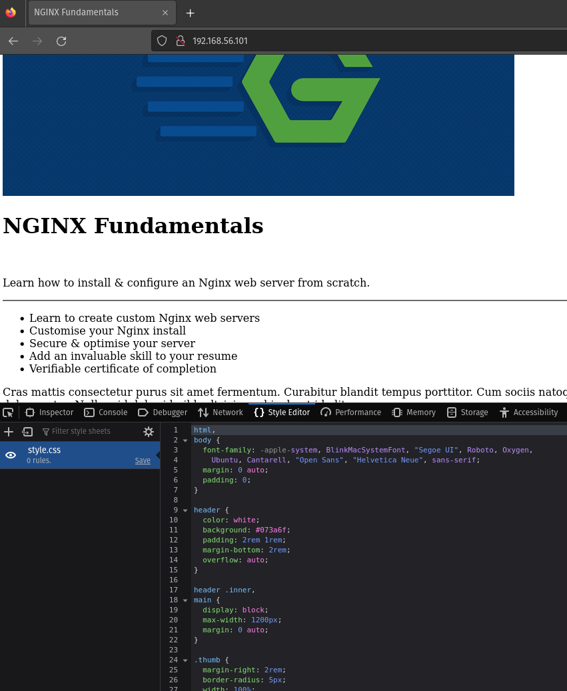
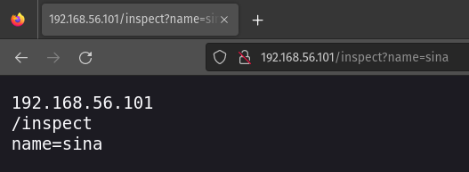
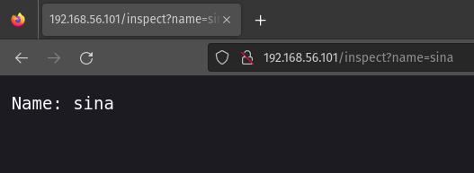

# What is Nginx?

**NGINX** is open source software for web serving, reverse proxying, caching, load balancing, media streaming, and more. It started out as a web server designed for maximum performance and stability. In addition to its HTTP server capabilities, NGINX can also function as a proxy server for email (IMAP, POP3, and SMTP) and a reverse proxy and load balancer for HTTP, TCP, and UDP servers.

Created in 2004 by Igor sysoev.

[C10k problem - Wikipedia](https://en.wikipedia.org/wiki/C10k_problem)

**NGINX** supports all the components of the modern Web, including WebSocket, HTTP/2, gRPC, and streaming of multiple video formats (HDS, HLS, RTMP, and others).

# Nginx vs Apache

**Apache** By default is configured in fork mode which it spawns a set number of processes, each of it can serve a single request at a time, regardless of what that request is for PHP script or  an image. On the other hand, **NGINX** deals with requests asynchronously, meaning that a single engine process can serve multiple requests concurrently with that number (depend on available resource). 

Because of asynchronous design, **NGINX**, unlike **Apache** cant embed server side programming languages into its own processes, meaning that all requests for dynamic content has to be dealt with by a completely separate process like **FPM** and then reverse proxy back to the client via **NGINX**.


##### Is Nginx faster that Apache?

Unlike **Apache**, the server side language module don't need to be run for every single request that server recieves. Instead **NGINX** will handle serving static resources without knowing about it, whereas **Apache** will handle every request with that costly overhead.

**NGINX** can't magically deliver data to the client (any faster than the internet connection will allow), but: 

* It can a serve static resources much faster than **Apache**

* Handle much large number of concurrent requests.

Dynamic sites, built using anything from Node.js to PHP, commonly deploy NGINX as a content cache and reverse proxy to reduce load on application servers and make the most effective use of the underlying hardware.

:memo: Remember it, **Nginx** will serve static resources without the need to involve any server side languages.

# Installing NGINX

## With Package Manager

```bash
apt-get update
apt-get install nginx
ps aux | grep nginx
curl http://localhost
ls -l /etc/nginx
```

## From Source

```bash
apt-get install build-essential
wget https://nginx.org/download/nginx-1.23.4.tar.gz
tar -xzvf nginx-1.23.4.tar.gz
cd nginx-1.23.4/
./configure
apt-get install libpcre3 libpcre3-dev zlib1g zlib1g-dev libssl-dev
./configure \
--sbin-path=/usr/bin/nginx \
--conf-path=/etc/nginx/nginx.conf \
--error-log-path=/var/log/nginx/error.log \
--http-log-path=/var/log/nginx/access.log \
--with-pcre \
--pid-path=/var/run/nginx.pid \
--with-http_ssl_module
```

Read: [Building nginx from Sources](https://nginx.org/en/docs/configure.html)

```shellsession
root@host:~/nginx-1.23.4# ./configure --help

  --help                             print this message

  --prefix=PATH                      set installation prefix
  --sbin-path=PATH                   set nginx binary pathname
  --modules-path=PATH                set modules path
  --conf-path=PATH                   set nginx.conf pathname
  --error-log-path=PATH              set error log pathname
  --pid-path=PATH                    set nginx.pid pathname
  --lock-path=PATH                   set nginx.lock pathname

  --user=USER                        set non-privileged user for
                                     worker processes
  --group=GROUP                      set non-privileged group for
                                     worker processes

  --build=NAME                       set build name
  --builddir=DIR                     set build directory

  --with-select_module               enable select module
  --without-select_module            disable select module
  --with-poll_module                 enable poll module
  --without-poll_module              disable poll module

  --with-threads                     enable thread pool support

  --with-file-aio                    enable file AIO support

  --with-http_ssl_module             enable ngx_http_ssl_module
  --with-http_v2_module              enable ngx_http_v2_module
  --with-http_realip_module          enable ngx_http_realip_module
  --with-http_addition_module        enable ngx_http_addition_module
  --with-http_xslt_module            enable ngx_http_xslt_module
  --with-http_xslt_module=dynamic    enable dynamic ngx_http_xslt_module
  --with-http_image_filter_module    enable ngx_http_image_filter_module
  --with-http_image_filter_module=dynamic
                                     enable dynamic ngx_http_image_filter_module
  --with-http_geoip_module           enable ngx_http_geoip_module
  --with-http_geoip_module=dynamic   enable dynamic ngx_http_geoip_module
  --with-http_sub_module             enable ngx_http_sub_module
  --with-http_dav_module             enable ngx_http_dav_module
  --with-http_flv_module             enable ngx_http_flv_module
  --with-http_mp4_module             enable ngx_http_mp4_module
  --with-http_gunzip_module          enable ngx_http_gunzip_module
  --with-http_gzip_static_module     enable ngx_http_gzip_static_module
  --with-http_auth_request_module    enable ngx_http_auth_request_module
  --with-http_random_index_module    enable ngx_http_random_index_module
  --with-http_secure_link_module     enable ngx_http_secure_link_module
  --with-http_degradation_module     enable ngx_http_degradation_module
  --with-http_slice_module           enable ngx_http_slice_module
  --with-http_stub_status_module     enable ngx_http_stub_status_module

  --without-http_charset_module      disable ngx_http_charset_module
  --without-http_gzip_module         disable ngx_http_gzip_module
  --without-http_ssi_module          disable ngx_http_ssi_module
  --without-http_userid_module       disable ngx_http_userid_module
  --without-http_access_module       disable ngx_http_access_module
  --without-http_auth_basic_module   disable ngx_http_auth_basic_module
  --without-http_mirror_module       disable ngx_http_mirror_module
  --without-http_autoindex_module    disable ngx_http_autoindex_module
  --without-http_geo_module          disable ngx_http_geo_module
  --without-http_map_module          disable ngx_http_map_module
  --without-http_split_clients_module disable ngx_http_split_clients_module
  --without-http_referer_module      disable ngx_http_referer_module
  --without-http_rewrite_module      disable ngx_http_rewrite_module
  --without-http_proxy_module        disable ngx_http_proxy_module
  --without-http_fastcgi_module      disable ngx_http_fastcgi_module
  --without-http_uwsgi_module        disable ngx_http_uwsgi_module
  --without-http_scgi_module         disable ngx_http_scgi_module
  --without-http_grpc_module         disable ngx_http_grpc_module
  --without-http_memcached_module    disable ngx_http_memcached_module
  --without-http_limit_conn_module   disable ngx_http_limit_conn_module
  --without-http_limit_req_module    disable ngx_http_limit_req_module
  --without-http_empty_gif_module    disable ngx_http_empty_gif_module
  --without-http_browser_module      disable ngx_http_browser_module
  --without-http_upstream_hash_module
                                     disable ngx_http_upstream_hash_module
  --without-http_upstream_ip_hash_module
                                     disable ngx_http_upstream_ip_hash_module
  --without-http_upstream_least_conn_module
                                     disable ngx_http_upstream_least_conn_module
  --without-http_upstream_random_module
                                     disable ngx_http_upstream_random_module
  --without-http_upstream_keepalive_module
                                     disable ngx_http_upstream_keepalive_module
  --without-http_upstream_zone_module
                                     disable ngx_http_upstream_zone_module

  --with-http_perl_module            enable ngx_http_perl_module
  --with-http_perl_module=dynamic    enable dynamic ngx_http_perl_module
  --with-perl_modules_path=PATH      set Perl modules path
  --with-perl=PATH                   set perl binary pathname

  --http-log-path=PATH               set http access log pathname
  --http-client-body-temp-path=PATH  set path to store
                                     http client request body temporary files
  --http-proxy-temp-path=PATH        set path to store
                                     http proxy temporary files
  --http-fastcgi-temp-path=PATH      set path to store
                                     http fastcgi temporary files
  --http-uwsgi-temp-path=PATH        set path to store
                                     http uwsgi temporary files
  --http-scgi-temp-path=PATH         set path to store
                                     http scgi temporary files

  --without-http                     disable HTTP server
  --without-http-cache               disable HTTP cache

  --with-mail                        enable POP3/IMAP4/SMTP proxy module
  --with-mail=dynamic                enable dynamic POP3/IMAP4/SMTP proxy module
  --with-mail_ssl_module             enable ngx_mail_ssl_module
  --without-mail_pop3_module         disable ngx_mail_pop3_module
  --without-mail_imap_module         disable ngx_mail_imap_module
  --without-mail_smtp_module         disable ngx_mail_smtp_module

  --with-stream                      enable TCP/UDP proxy module
  --with-stream=dynamic              enable dynamic TCP/UDP proxy module
  --with-stream_ssl_module           enable ngx_stream_ssl_module
  --with-stream_realip_module        enable ngx_stream_realip_module
  --with-stream_geoip_module         enable ngx_stream_geoip_module
  --with-stream_geoip_module=dynamic enable dynamic ngx_stream_geoip_module
  --with-stream_ssl_preread_module   enable ngx_stream_ssl_preread_module
  --without-stream_limit_conn_module disable ngx_stream_limit_conn_module
  --without-stream_access_module     disable ngx_stream_access_module
  --without-stream_geo_module        disable ngx_stream_geo_module
  --without-stream_map_module        disable ngx_stream_map_module
  --without-stream_split_clients_module
                                     disable ngx_stream_split_clients_module
  --without-stream_return_module     disable ngx_stream_return_module
  --without-stream_set_module        disable ngx_stream_set_module
  --without-stream_upstream_hash_module
                                     disable ngx_stream_upstream_hash_module
  --without-stream_upstream_least_conn_module
                                     disable ngx_stream_upstream_least_conn_module
  --without-stream_upstream_random_module
                                     disable ngx_stream_upstream_random_module
  --without-stream_upstream_zone_module
                                     disable ngx_stream_upstream_zone_module

  --with-google_perftools_module     enable ngx_google_perftools_module
  --with-cpp_test_module             enable ngx_cpp_test_module

  --add-module=PATH                  enable external module
  --add-dynamic-module=PATH          enable dynamic external module

  --with-compat                      dynamic modules compatibility

  --with-cc=PATH                     set C compiler pathname
  --with-cpp=PATH                    set C preprocessor pathname
  --with-cc-opt=OPTIONS              set additional C compiler options
  --with-ld-opt=OPTIONS              set additional linker options
  --with-cpu-opt=CPU                 build for the specified CPU, valid values:
                                     pentium, pentiumpro, pentium3, pentium4,
                                     athlon, opteron, sparc32, sparc64, ppc64

  --without-pcre                     disable PCRE library usage
  --with-pcre                        force PCRE library usage
  --with-pcre=DIR                    set path to PCRE library sources
  --with-pcre-opt=OPTIONS            set additional build options for PCRE
  --with-pcre-jit                    build PCRE with JIT compilation support
  --without-pcre2                    do not use PCRE2 library

  --with-zlib=DIR                    set path to zlib library sources
  --with-zlib-opt=OPTIONS            set additional build options for zlib
  --with-zlib-asm=CPU                use zlib assembler sources optimized
                                     for the specified CPU, valid values:
                                     pentium, pentiumpro

  --with-libatomic                   force libatomic_ops library usage
  --with-libatomic=DIR               set path to libatomic_ops library sources

  --with-openssl=DIR                 set path to OpenSSL library sources
  --with-openssl-opt=OPTIONS         set additional build options for OpenSSL

  --with-debug                       enable debug logging
```

The absolute main benefit of building NGINX from source is the ability to add custom modules or essentially extend the standard NGINX functionality.

#### Adding an NGINX Service

`nginx -s stop`: Stop the NGINX service

Save this file as `/lib/systemd/system/nginx.service`:

```systemd
[Unit]
Description=The NGINX HTTP and reverse proxy server
After=syslog.target network-online.target remote-fs.target nss-lookup.target
Wants=network-online.target

[Service]
Type=forking
PIDFile=/run/nginx.pid
ExecStartPre=/usr/sbin/nginx -t
ExecStart=/usr/sbin/nginx
ExecReload=/usr/sbin/nginx -s reload
ExecStop=/bin/kill -s QUIT $MAINPID
PrivateTmp=true

[Install]
WantedBy=multi-user.target
```

# Configuration

## Terms

Two main configuration terms:

* **Context:**  Some sections within the configuration where directives can be set for that given context. Essentially, context is the same as scope and like scope context are also nested and inherit from their parents with the topmost context simply is the configuration file itself. This is called the main context and is where we configure global directives that apply to the master process.
  
  **Important contexts:**
  
  * **HTTP:** For any HTTP related things
  
  * **Server:** Which is where we define a **virtualhost** (similar to Apache vhost) 
  
  * **Location:** For matching URI location on incoming requests to parent server context.

* **Directive:** A specific configuration options that get/set in the configuration files and consist of a name and a value context.

From NGINX Documentation:

> *1. nginx consists of modules which are controlled by directives specified in the configuration file.*
> 
> *2. Directives are divided into simple directives and block directives. A simple directive consists of the name and parameters separated by spaces and ends with a semicolon `;`.*
> 
> *3. A block directive has the same structure as a simple directive, but instead of the semicolon it ends with a set of additional instructions surrounded by braces `{` and `}`.*
> 
> *4. If a block directive can have other directives inside braces, it is called a context (examples: [events](https://nginx.org/en/docs/ngx_core_module.html#events), [http](https://nginx.org/en/docs/http/ngx_http_core_module.html#http), [server](https://nginx.org/en/docs/http/ngx_http_core_module.html#server), and [location](https://nginx.org/en/docs/http/ngx_http_core_module.html#location).*
> 
> *5. Directives placed in the configuration file outside of any contexts are considered to be in the [main](https://nginx.org/en/docs/ngx_core_module.html) context. The `events` and `http` directives reside in the `main` context, `server` in `http`, and `location` in `server`.*
> 
> *6. The rest of a line after the `#` sign is considered a comment.*

## Virtualhost

:memo: If there is nothing in `events` context, because of config file validation we can't delete it so we should let it empty.

```nginx
events {}
```

FIrst we need to define a virtualhost in `http` context. Each virtualhost being a new `server` context or **server block**. Virtualhost or server context is essentially responsible for listening on a port (typically 80 for HTTP and 443 for HTTPS).

```nginx
http {

    server {

        listen 80;
        server_name 192.168.56.101;

        root /sites/demo;
    }
}
```

:memo: Check NGINX configuration -after changes/before reload- with `nginx -t` command.

At this stage when you browse the content in a browser, at first it seems the stylesheets is not loaded, if we check in browser's development tools, we see that everything is in fact loaded just fine. 



So what is happening here?

NGINX is sending the wrong **MIME type** with the stylesheet

We can confirm this by requesting the style.css using `curl`.

```shell
user@host:~$ curl -I http://192.168.56.101/style.css
HTTP/1.1 200 OK
Server: nginx/1.18.0 (Ubuntu)
Date: Wed, 26 Apr 2023 20:12:26 GMT
Content-Type: text/plain
Content-Length: 980
Last-Modified: Wed, 26 Apr 2023 19:24:50 GMT
Connection: keep-alive
ETag: "64497a82-3d4"
Accept-Ranges: bytes
```

Line 5: <mark>Content-Type: text/plain</mark>

We can resolve this problem with `types` context:

```nginx
events {}

http {

    types {
        text/html html;
        text/css css;
    }

    server {

        listen 80;
        server_name 192.168.56.101;

        root /sites/demo;
    }
}
```

The easier way:

NGINX allows us to iclude pieces of configuration from seperate files and one of those files that already exists is the `mime.types` in `/etc/nginx` which if you check its content, it contains very type's contexts. Check it!

Instead of defining `types` context ourselves, we can `iclude` the content of this file directly into our configuration.

```nginx
events {}

http {

    include mime.types;

    server {

        listen 80;
        server_name 192.168.56.101;

        root /sites/demo;
    }
}
```

## Location Blocks

In Nginx, a location block is used to define how Nginx should handle requests for a specific URI or URI pattern. The location block is usually nested inside a server block and can contain directives that define how Nginx should handle requests for the specified URI or URI pattern. The location block enables you to handle several types of URIs/routes, within a server block. Typically, you'd make use of one or more regular expressions to match the URI or URI pattern. When a request comes in, Nginx first tries to match the URI to a location block with an exact match. If no exact match is found, Nginx tries to match the URI to a location block with a regular expression. If multiple location blocks match the URI, Nginx uses the one with the longest matching prefix.

Great for static resources.

```nginx
events {}

http {

    include mime.types;

    server {

        listen 80;
        server_name 192.168.56.101;

        root /sites/demo;

        # Prefix match
        location /greet {
            return 200 'Hello from NGINX "/greet" location (Prefix match).';
        }

        # Exact match
        location = /greet {
            return 200 'Hello from NGINX "/greet" location (Exact match).';
        }

        # Regex match - case sensitive
        location ~ /greet[0-9] {
            return 200 'Hello from NGINX "/greet" location (Regex match).';
        }

        # Regex match - case insensitive
        location /greet {
            return 200 'Hello from NGINX "/greet" location (case insensitive Regex ).';
        }
        # Preferential prefix match 
        location ^~ /greet {
            return 200 'Hello from NGINX "/greet" location.';
        }
    }
}
```

The Order:

1. Exact match (= URI)

2. Preferential Prefix Match (^\~ URI)

3. REGEX Match (\~\* URI)

4. Prefix Match (URI)

## Variables

In NGINX, variables can be defined using the set directive provided by the rewrite module. NGINX variables are used to store and manipulate data within the NGINX configuration file. Variables in NGINX are denoted by a dollar sign ($) prefix, and they can contain alphanumeric characters, underscores, and dashes.

There are two types of variables in NGINX: system variables and user-defined variables. System variables are predefined by NGINX and are used to represent information about the client request, such as the request method, headers, and query parameters. User-defined variables are created by the NGINX configuration file and can be used to store and manipulate data as needed.

There are 2 types of varibales in NGINX:

1. Configuration Variables (User-defiend)

2. NGINX Module Variables (System)

[Alphabetical index of variables](https://nginx.org/en/docs/varindex.html)

```nginx
events {}

http {

    include mime.types;

    server {

        listen 80;
        server_name 192.168.56.101;

        root /sites/demo;

        location /inspect {

            return 200 "$host\n$uri\n$args";
        }
    }
}
```

```shell-session
root@host:~# curl http://localhost/inspect
localhost
/inspect
root@host:~# curl http://127.0.0.1/inspect
127.0.0.1
/inspect
root@host:~# curl http://192.168.56.101/inspect
192.168.56.101
/inspect
```



Change the location block to this:

```nginx
location /inspect {

    return 200 "Name: $arg_name";
}
```



## Conditionals

Conditionals in NGINX configuration allow you to control the flow of traffic based on certain conditions. Conditionals in NGINX configuration are used to execute certain directives based on a condition. The syntax for conditionals is similar to that of if-else statements in programming languages. However, it is important to note that using conditionals in NGINX configuration can have performance implications and should be used with caution.

There are two types of conditionals in NGINX configuration:

1. If-Else Conditionals
2. Map Block Conditionals

### 1. If-Else Conditionals

If-Else conditionals in NGINX configuration allow you to test a condition and perform different actions based on whether the condition is true or false.

```nginx
if ($request_method = POST) {
   return 405;
}

if ($http_user_agent ~* MSIE) {
   rewrite ^(.*)$ /msie/$1 break;
}

if ($http_cookie ~* "id=([^;]+)(?:;|$)") {
   set $id $1;
}

if ($http_referer !~* (example.com|google.com)) {
   return 403;
}
```

In this example, NGINX tests the request method and returns a 405 error if it's a POST request, rewrites the URL for Internet Explorer users, sets a variable based on the value of a cookie, and returns a 403 error if the referring website is not example.com or google.com.

### 2. Map Block Conditionals

Map block conditionals in NGINX configuration allow you to perform actions based on the value of a variable.

```nginx
map $http_upgrade $connection_upgrade {
   default upgrade;
   ''      close;
}

server {
   listen 80;
   server_name example.com;

   location / {
      proxy_pass http://backend;
      proxy_set_header Upgrade $http_upgrade;
      proxy_set_header Connection $connection_upgrade;
   }
}
```

In this example, NGINX maps the value of the `$http_upgrade` variable to either "upgrade" or "close". If the value of `$http_upgrade` is "upgrade", the `Upgrade` and `Connection` headers are set to the values of `$http_upgrade` and `$connection_upgrade`, respectively.

**Examples:**

```nginx
events {}

http {

    include mime.types;

    server {

        listen 80;
        server_name 192.168.56.101;

        root /sites/demo;

        if ( $arg_apikey != 1234 ) {

            return 401 "Incorrect API key\n";
        }

        location /inspect {

            return 200 "Name: $arg_name";
        }
    }
}
```

```shell-session
root@host:~# curl http://192.168.56.101
Incorrect API keyroot
root@host:~# curl http://192.168.56.101?apikey=1234
<!DOCTYPE html>
<html>

<head>
...
.
.
```

```nginx
events {}

http {

    include mime.types;

    server {

        listen 80;
        server_name 192.168.56.101;

        root /sites/demo;

        set $weekend 'No';

        if ( $date_local ~ 'Saturday|Sunday') {
            set $weekend 'Yes'
        }

        location /inspect {

            return 200 $weekend;
        }
    }
}
```

```shellsession
root@host:~# curl http://192.168.56.101/inspect
No
```

[If is Evil… when used in location context | NGINX](https://www.nginx.com/resources/wiki/start/topics/depth/ifisevil/)

## Rewrites

There are two directives for rewriting requests:

1. `rewrite pattern URI`

2. `return ststus URI`

**Redirect:** Simply Tells the client performing the request where to go instead.

```nginx
location /logo {
    return 307 /thumb.png;
}
```

**Rewrite:** mutate the URI internally.

When a URi is rewritten, it also get re-evaluated by NGINX as a completely new request.

The "rewrite" directive in NGINX allows you to modify URLs before they are processed by the server. This can be useful for redirecting URLs to a new location or for changing the URL structure of your site.

**Syntax:** `rewrite regex replacement [flag];`

The "regex" is a regular expression that matches the URL that you want to modify, and the "replacement" is the new URL that you want to use. The "flag" is an optional argument that specifies additional behavior for the rewrite, such as case sensitivity or whether to stop processing further rewrite rules.

**Examples:**

```nginx
# 1
rewrite ^/oldpage /newpage permanent;
# 2
rewrite ^/category/(.*)$ /shop/category/$1 last;
# 3
rewrite ^(.*)\.html$ $1.php;
```

1. In this example, any request for "/oldpage" will be redirected to "/newpage". The "permanent" flag specifies that a 301 Moved Permanently response should be sent, indicating to search engines that the old URL has been permanently replaced by the new URL.

2. In this example, any request for a URL that starts with "/category/" will be rewritten to "/shop/category/", with the remainder of the URL preserved. The "last" flag specifies that this is the last rewrite rule to be processed for this request, so no further rules will be applied.

3. In this example, any request for a URL that ends with ".html" will be rewritten to end with ".php" instead.

```nginx
server {

    rewrite ^/user\w+ /greet;
}
```

## Try Files & Named Locations

The Nginx "try_files" directive is a configuration directive used to define a sequence of files that Nginx should attempt to serve when a specific URL is requested. It is commonly employed for handling dynamic URL routing, fallbacks, and error handling in Nginx server configurations.

**Syntax:** `try_files path1 path2 final;`

When a client makes a request for a particular URL, Nginx evaluates the "try_files" directive to determine the files it should try serving. It sequentially checks each file in the specified order until it finds a match. If Nginx successfully finds and serves a file, the request is considered fulfilled. However, if none of the files in the "try_files" directive exist, Nginx generates a "404 Not Found" error.

The "try_files" directive commonly employs variables such as `$uri` and `$uri/`. Here's an explanation of these variables:

- `$uri`: Represents the path of the requested URL. It refers to the exact file specified in the URL.
- `$uri/`: Represents a directory with the same name as the requested URL. This allows Nginx to serve the default index file within that directory.

It is also possible to specify an absolute file path instead of using variables in the "try_files" directive. This allows for serving specific files that may not follow the URL structure directly.

## Logging

Logging is an integral part of NGINX server administration, providing crucial insights into server activity and aiding in troubleshooting and monitoring. NGINX offers comprehensive logging capabilities, allowing administrators to capture and analyze various types of information, including server access details, error messages, and other significant events. Effective logging practices ensure the smooth operation and security of NGINX servers.

### 1. Access Logss

Access logs record essential information about incoming requests to the NGINX server. They include details such as the client's IP address, the requested URL, the HTTP status code, and relevant request headers. Access logs play a vital role in analyzing traffic patterns, identifying potential security threats, and monitoring server performance.

To enable access logging, it is necessary to define the log format and specify the log file path in the NGINX configuration. Administrators can create custom log formats using specific variables to capture desired information accurately. Here's an example configuration block:

```nginx
 http {
   ...
   log_format custom_log '$remote_addr - $remote_user [$time_local] '
                        '"$request" $status $body_bytes_sent '
                        '"$http_referer" "$http_user_agent"';

   access_log /var/log/nginx/access.log custom_log;
   ...
 }
```

### 2. Error Logs:

Error logs capture any errors or warnings encountered by the NGINX server. They are crucial for identifying misconfigurations, troubleshooting issues, and detecting potential security vulnerabilities. Error logs cover various aspects, including configuration errors, proxying errors, SSL/TLS errors, and more.

By default, NGINX logs error messages to the standard error output, typically the system log. However, administrators can specify a separate error log file for better log management and analysis. Here's an example configuration block:

```nginx
error_log /var/log/nginx/error.log;
```

### Hacks & Tricks in NGINX Logging

#### 1. Conditional Logging

Conditional logging allows you to selectively enable or disable logging for specific requests based on various criteria. This feature provides flexibility in capturing only relevant information in your logs, optimizing log file sizes and improving log analysis efficiency.

**Example:**

```nginx
http {
  ...
  map $request_uri $loggable {
    default  1;
    /admin/* 0;
  }

  server {
    ...
    if ($loggable) {
      access_log /var/log/nginx/access.log;
    }
    ...
  }
}
```

**Explanation:**

In this example, the `map` directive is used to create a variable called `$loggable`. The `map` directive maps the request URI to a loggable value, with a default value of `1` (indicating logging is enabled for all requests). However, requests starting with `/admin/` are mapped to a value of `0`, indicating logging should be disabled for them.

The `if` directive is then used to conditionally enable access logging based on the value of `$loggable`. If the value is non-zero (i.e., not `/admin/`), the `access_log` directive is executed, and the request is logged to the specified log file (`/var/log/nginx/access.log`).

#### 2. Customizing Error Log Levels

NGINX allows you to customize the level of verbosity in error logging, enabling you to control the amount of detail captured in error logs. This feature helps streamline log analysis and focuses attention on critical errors and warnings.

**Example:**

```nginx
error_log /var/log/nginx/error.log warn;
```

**Explanation:**
In this example, the `error_log` directive specifies the path (`/var/log/nginx/error.log`) where error log messages should be written. Additionally, the log level is set to `warn`, which means NGINX will log warning messages and more severe errors. This configuration ensures that only significant issues are logged in the error log file.

#### 3. Logging Real IP Addresses:

When NGINX is placed behind a proxy or load balancer, the client's IP address may be masked by default. Logging the actual client IP address is important for security, analytics, and compliance purposes. NGINX provides directives to log the real IP address by identifying trusted sources.

**Example:**

```nginx
http {
  ...
  real_ip_header X-Forwarded-For;
  set_real_ip_from 192.0.2.0/24;
  ...
}
```

**Explanation:**

In this example, the `real_ip_header` directive is set to `X-Forwarded-For`, which specifies the header field that contains the real client IP address. This header is commonly used by proxies and load balancers to forward the original client IP. The `set_real_ip_from` directive specifies the IP range (`192.0.2.0/24`) from which the trusted proxy server's IP address is expected. NGINX will extract the real client IP from the specified header and update the `$remote_addr` variable with the correct value for logging purposes.

### Log Rotation

Log rotation is an important practice for managing log files in NGINX. It involves periodically archiving or rotating log files to prevent them from growing too large and consuming excessive disk space. NGINX itself does not handle log rotation directly; instead, it relies on external tools or utilities to perform the rotation

The following example demonstrates how to configure log rotation for NGINX using `logrotate` in a Linux environment:

```bash
/var/log/nginx/*.log {
    weekly
    missingok
    rotate 52
    compress
    delaycompress
    notifempty
    create 0640 www-data adm
    sharedscripts
    postrotate
        /etc/init.d/nginx reload > /dev/null
    endscript
}
```

By implementing log rotation for NGINX logs, you can effectively manage log file sizes, optimize system performance, retain log data for compliance purposes, and streamline log analysis.

## Inheritence and Directive types

Inheritance allows directives to be inherited from higher-level contexts to lower-level contexts within the NGINX configuration hierarchy. This hierarchy includes the main configuration file, server blocks, location blocks, and nested blocks.

Directives defined in higher-level contexts are inherited by default, but can be overridden or modified in lower-level contexts. This enables you to define global settings in the main configuration and selectively override them at more specific levels.

```nginx
http {
  # Global settings
  server_tokens off;
  keepalive_timeout 60s;

  server {
    # Server-specific settings
    listen 80;
    server_name example.com;
  }
}
```

**Directives Types:**

```nginx
events {}

######################
# (1) Array Directive
######################
# Can be specified multiple times without overriding a previous setting
# Gets inherited by all child contexts
# Child context can override inheritance by re-declaring directive
access_log /var/log/nginx/access.log;
access_log /var/log/nginx/custom.log.gz custom_format;

http {

  # Include statement - non directive
  include mime.types;

  server {
    listen 80;
    server_name site1.com;

    # Inherits access_log from parent context (1)
  }

  server {
    listen 80;
    server_name site2.com;

    #########################
    # (2) Standard Directive
    #########################
    # Can only be declared once. A second declaration overrides the first
    # Gets inherited by all child contexts
    # Child context can override inheritance by re-declaring directive
    root /sites/site2;

    # Completely overrides inheritance from (1)
    access_log off;

    location /images {

      # Uses root directive inherited from (2)
      try_files $uri /stock.png;
    }

    location /secret {
      #######################
      # (3) Action Directive
      #######################
      # Invokes an action such as a rewrite or redirect
      # Inheritance does not apply as the request is either stopped (redirect/response) or re-evaluated (rewrite)
      return 403 "You do not have permission to view this.";
    }
  }
}
```

## PHP Processing

### Introduction to server side language process

NGINX is a high-performance web server that excels at serving static content and efficiently handling HTTP requests. However, it does not include native support for embedding or executing server-side language processes within its core functionality. This means that NGINX alone cannot directly process server-side languages like PHP. Instead, NGINX relies on external processes or modules, such as PHP-FPM, to handle the execution of server-side scripts. PHP-FPM, as a separate application server, runs independently and communicates with NGINX through the FastCGI protocol, allowing NGINX to delegate dynamic content generation to the PHP interpreter.

By utilizing this separate application server approach, NGINX can effectively handle the simultaneous serving of static files and proxy requests to the PHP-FPM process, ensuring efficient and scalable handling of dynamic content while maintaining its optimized performance for static content delivery.

| Language       | Service/Software                                            | Description                                                                                                                                                                                                                             |
| -------------- | ----------------------------------------------------------- | --------------------------------------------------------------------------------------------------------------------------------------------------------------------------------------------------------------------------------------- |
| PHP            | PHP-FPM, mod_php (Apache), php-cgi, HHVM                    | PHP-FPM (FastCGI Process Manager) is a popular PHP FastCGI implementation. mod_php is an Apache module that embeds PHP. php-cgi is a Common Gateway Interface for PHP. HHVM (HipHop Virtual Machine) is an alternative runtime for PHP. |
| Python         | uWSGI, Gunicorn, mod_wsgi (Apache), FastCGI, ASGI           | uWSGI and Gunicorn are commonly used application servers for Python. mod_wsgi is an Apache module for hosting Python applications. FastCGI and ASGI (Asynchronous Server Gateway Interface) can also be used with Python.               |
| Ruby           | Passenger, Unicorn, Thin, FastCGI, Puma                     | Passenger, Unicorn, Thin, and Puma are Ruby application servers. FastCGI can also be used with Ruby.                                                                                                                                    |
| Java           | Apache Tomcat, Jetty, WildFly (formerly JBoss), GlassFish   | Apache Tomcat, Jetty, WildFly, and GlassFish are popular Java application servers.                                                                                                                                                      |
| Node.js        | Node.js HTTP server, Express.js, PM2, Forever, Nodemon      | Node.js itself includes a built-in HTTP module for creating a web server. Express.js is a popular web framework for Node.js. PM2, Forever, and Nodemon are process managers for Node.js applications.                                   |
| .NET Framework | IIS (Internet Information Services), Kestrel (ASP.NET Core) | Internet Information Services (IIS) is a web server provided by Microsoft for hosting .NET applications. Kestrel is a web server for hosting ASP.NET Core applications.                                                                 |
| Go             | Go HTTP server, FastCGI, Reverse Proxy (e.g., Caddy), Gin   | Go provides a built-in HTTP server package for hosting Go applications. FastCGI, Reverse Proxy servers, and Gin (a Go web framework) can also be used with Go.                                                                          |
| Perl           | mod_perl (Apache), FastCGI, PSGI/Plack                      | mod_perl is an Apache module that embeds the Perl interpreter. FastCGI and PSGI/Plack (Perl Web Server Gateway Interface) can also be used with Perl.                                                                                   |
| Rust           | Actix, Rocket, Warp, Iron                                   | Actix, Rocket, Warp, and Iron are web frameworks for Rust that can be used for server-side processing.                                                                                                                                  |

The services or software mentioned in the table can be categorized into different types based on their purpose and functionality. Here are the types of services or software commonly used for server-side processing:

1. **Application Servers:** These are servers specifically designed to host and execute applications written in a particular language. They provide features like request handling, process management, and scalability. Examples include PHP-FPM, uWSGI, Gunicorn, Passenger, Apache Tomcat, Jetty, and GlassFish.

2. **Web Frameworks:** These are frameworks that simplify web application development by providing a set of tools, libraries, and abstractions. They often include their own server or can be deployed on various servers. Examples include Express.js (Node.js), Ruby on Rails (Ruby), Django (Python), Spring Boot (Java), and Rocket (Rust).

3. **Web Servers:** These are software programs responsible for handling HTTP requests, serving static files, and routing requests to appropriate application servers or frameworks. Examples include Nginx, Apache HTTP Server, and Internet Information Services (IIS).

4. **Web Servers (Language-specific):** Some languages come with their own built-in web servers that allow you to create and host web applications without external dependencies. Examples include the built-in HTTP server in Node.js and the built-in HTTP server package in Go.

5. **Process Managers:** These are tools that manage and monitor processes associated with running applications. They provide features like process control, automatic restarts, and logging. Examples include PM2, Forever, and Nodemon for Node.js applications.

6. **Language-Specific Runtimes:** Some languages have their own dedicated runtimes that enable the execution of code written in that language. Examples include HHVM (PHP), Kestrel (ASP.NET Core), and PSGI/Plack (Perl).

7. **Reverse Proxies:** These are servers or modules that sit between clients and backend servers, acting as an intermediary. They handle requests, load balancing, caching, and security features. Examples include Nginx (with reverse proxy module), Apache HTTP Server (with mod_proxy), and Caddy.

8. **FastCGI:** FastCGI (Fast Common Gateway Interface) is a protocol that allows web servers to communicate with external applications efficiently. It enables the separation of application processing from the web server. FastCGI can be used with various languages like PHP, Python, Ruby, and Perl.

9. **Gateway Interfaces:** These are interfaces or specifications that define how web servers communicate with web applications or frameworks. Examples include ASGI (Asynchronous Server Gateway Interface) for Python and PSGI/Plack (Perl Web Server Gateway Interface).

| Application/Service       | Type                                       | Supported Languages                           |
| ------------------------- | ------------------------------------------ | --------------------------------------------- |
| PHP-FPM                   | PHP Process Manager                        | PHP                                           |
| Apache mod_php            | Apache module                              | PHP                                           |
| HHVM                      | Virtual Machine                            | PHP                                           |
| Microsoft ASP.NET         | Framework                                  | C#, F#                                        |
| Node.js                   | Runtime Environment                        | JavaScript, TypeScript, CoffeeScript          |
| Ruby on Rails             | Framework                                  | Ruby                                          |
| Django                    | Framework                                  | Python                                        |
| Flask                     | Framework                                  | Python                                        |
| Pyramid                   | Framework                                  | Python                                        |
| Tornado                   | Web Server                                 | Python                                        |
| Gunicorn                  | WSGI HTTP Server                           | Python                                        |
| uWSGI                     | Application Server                         | Python, Ruby, Lua                             |
| Java Servlets             | Java-based API                             | Java                                          |
| Tomcat                    | Web Server/Servlet Container               | Java                                          |
| Jetty                     | Web Server/Servlet Container               | Java                                          |
| Wildfly                   | Application Server                         | Java                                          |
| Glassfish                 | Application Server                         | Java                                          |
| JBoss                     | Application Server                         | Java                                          |
| Spring Boot               | Framework                                  | Java                                          |
| Play Framework            | Framework                                  | Java, Scala                                   |
| Vert.x                    | Toolkit for building reactive applications | Java, JavaScript, Ruby, Kotlin, Scala, Groovy |
| Quarkus                   | Framework                                  | Java, Kotlin                                  |
| .NET Core                 | Framework                                  | C#, F#                                        |
| Go net/http               | Standard library package                   | Go                                            |
| Revel                     | Framework                                  | Go                                            |
| Echo                      | Framework                                  | Go                                            |
| Gin                       | Framework                                  | Go                                            |
| Buffalo                   | Framework                                  | Go                                            |
| Python HTTP Server        | Standard library package                   | Python                                        |
| SimpleHTTPServer          | Standard library module                    | Python                                        |
| Flask development server  | Development server                         | Python                                        |
| Django development server | Development server                         | Python                                        |
| Ruby WEBrick              | Web Server                                 | Ruby                                          |
| Puma                      | Web Server                                 | Ruby                                          |
| Unicorn                   | Web Server                                 | Ruby                                          |
| Thin                      | Web Server                                 | Ruby                                          |

### PHP-FPM

PHP-FPM (FastCGI Process Manager) is a highly efficient and popular PHP FastCGI implementation that works seamlessly with NGINX. It allows NGINX to handle PHP scripts and dynamically generate web content. PHP-FPM operates as a separate process pool, managing PHP script execution and providing enhanced performance and flexibility.

To set up PHP processing with PHP-FPM in NGINX, follow these steps:

1. **Install PHP and PHP-FPM**: Begin by installing PHP and PHP-FPM on your server. The installation process may vary depending on your operating system. Ensure that you install the appropriate PHP version and any required modules for your specific application.

2. **Configure PHP-FPM**: PHP-FPM has its own configuration file, typically located at `/etc/php-fpm.conf` or `/etc/php/{version}/fpm/php-fpm.conf`. Adjust the settings in this file to match your server's specifications. Important configuration options include specifying the user and group under which PHP-FPM should run and defining the listen address and port for PHP-FPM to accept connections.

3. **Configure NGINX**: In the NGINX configuration file (usually located at `/etc/nginx/nginx.conf` or `/etc/nginx/sites-available/default`), you need to add a location block to handle PHP requests.

**Example:**

```nginx
user www-data;

events {}

http {

  include mime.types;

  server {

    listen 80;
    server_name 167.99.93.26;

    root /sites/demo;

    index index.php index.html;

    location / {
      try_files $uri $uri/ =404;
    }

    location ~\.php$ {
      # Pass php requests to the php-fpm service (fastcgi)
      include fastcgi.conf;
      fastcgi_pass unix:/run/php/php7.1-fpm.sock;
    }

  }
}
```

The `location ~ \.php$ {}` block uses a regular expression match to identify PHP files. Requests for PHP files are then passed to the PHP-FPM service using FastCGI. The `include fastcgi.conf;` directive includes the FastCGI configuration file for PHP. Adjust the `fastcgi_pass` directive to match the path where your PHP-FPM service is listening. In this example, it's set to `unix:/run/php/php7.1-fpm.sock`.

The `index.php` file:

```php
<?php
phpinfo();
?>
```

You can find the path of FPM socket through this command:

```shellsession
$ find / -name *.fpm.sock*
```

## Worker Processes

### worker_processes

The `worker_processes` directive in NGINX allows you to specify the number of worker processes that will handle client requests. Each worker process operates independently and is capable of handling multiple connections simultaneously. This feature is designed to maximize the utilization of system resources and improve the performance of your NGINX server.

The `worker_processes` directive determines the number of worker processes that NGINX will create to handle incoming client requests. Each worker process is responsible for managing connections, processing requests, and serving responses independently of other worker processes.

By **default**, NGINX starts with a **single** worker process, but you can adjust this value based on your server's capabilities and workload requirements. Increasing the number of worker processes can enhance the server's ability to handle a higher number of concurrent connections and improve overall performance.

The `worker_processes` directive should be placed within the main context of the NGINX configuration file. The main context is the top-level context that contains global directives applicable to the entire NGINX server.

**Example:**

```nginx
worker_processes 4; # We can set it to 'auto'

events {
    # Other event-related directives
}

http {
    # Other HTTP-related directives
}
```

When choosing the appropriate value for `worker_processe`, consider factors such as the **number of CPU cores** available on your server, available memory, and the expected traffic load. Ideally, set the `worker_processes` value equal to the **number of CPU cores** to take advantage of parallel processing.

### worker_connections

The `worker_connections` directive in NGINX allows you to specify the maximum number of simultaneous connections that each worker process can handle. It defines the limit for concurrent client connections that NGINX can process efficiently. Properly configuring this directive is crucial to ensure optimal performance and prevent overloading the server.

By **default**, NGINX is configured with a value of **512** for `worker_connections`. However, you may need to adjust this value based on your server's capacity and expected traffic load. Configuring an optimal value helps prevent bottlenecks and ensures smooth handling of client requests.

The `worker_connections` directive should be placed within the `events` context of the NGINX configuration file. The `events` context is responsible for configuring various aspects related to event processing in NGINX, including connection handling.

To set an appropriate value for `worker_connections`, you must consider both NGINX configuration and system-level settings. One crucial system-level setting is the maximum number of files that each core can open. **Insufficient file descriptors** can limit the number of connections NGINX can handle effectively.

To check the current limit for file descriptors, you can use the `ulimit` command in Linux:

```bash
ulimit -n
```

To set a higher limit, you can use the `ulimit` command with the `-n` flag followed by the desired number of maximum open files. For example, to set the maximum open files limit to 2048, use the following command:

```bash
ulimit -n 2048
```

Ensure that the specified limit is sufficient to accommodate the expected number of connections and other system processes running on the server.

After adjusting the system-level file descriptor limit, you can configure the `worker_connections` directive in the NGINX configuration file. It should be placed within the "events" context, which is responsible for configuring various aspects related to event processing in NGINX, including connection handling.

```nginx
worker_processes 4;

events {
    worker_connections 1024;
}

http {
    # Other HTTP-related directives
}
```

Remember to fine-tune the value of `worker_connections` based on observed traffic patterns, available system resources, and the maximum file descriptors limit set using the `ulimit` command. Monitoring your server's performance and conducting load testing can help you identify the optimal values for these settings.

Refer to the NGINX documentation for further details on configuring and optimizing the `worker_connections` directive and system-level file descriptor limits to achieve optimal performance and scalability.

### pid

The `pid` directive in NGINX allows you to specify the path to the process ID (PID) file. The PID file contains the process ID of the NGINX master process, which is the main controlling process for the NGINX server. The master process is responsible for managing worker processes, handling configuration changes, and controlling the overall operation of the NGINX server.

By default, NGINX creates a PID file named "nginx.pid" in the "logs" directory relative to the NGINX installation directory. However, you can customize the path and filename by specifying the desired path in the `pid` directive.

**Example:**

```nginx
pid /var/run/nginx/nginx.pid;
```

Having a PID file is useful for various purposes, including process management, monitoring, and graceful shutdowns. The PID file allows external processes or scripts to easily identify and interact with the NGINX master process by reading the process ID from the file.

```bash
#!/bin/bash

# Read the NGINX PID from the PID file
NGINX_PID=$(cat /var/run/nginx/nginx.pid)

# Check if the NGINX process is running
if ps -p $NGINX_PID > /dev/null; then
    echo "NGINX is running with PID: $NGINX_PID"
else
    echo "NGINX is not running"
fi

# Send a signal to the NGINX master process
kill -HUP $NGINX_PID
```

When NGINX starts, it checks if the PID file already exists. If it does and the process with the corresponding process ID is still running, NGINX will refuse to start to avoid conflicts. This ensures that only one instance of NGINX is running at a time. If the process with the specified PID is not running, NGINX will start and overwrite the existing PID file with the new process ID.

**NOTE:** It's important to ensure that the NGINX master process has write permissions to the specified directory so that it can create and update the PID file.

The `pid` directive should be placed within the `main` context of the NGINX configuration file. The `main` context is responsible for global configuration settings that apply to the entire NGINX server.

**Example:**

```nginx
http {
  client_body_buffer_size 10m;
  client_max_body_size 20m;
  client_header_buffer_size 4k;

  sendfile on;
  sendfile_max_chunk 512k;

  tcp_nopush on;
  tcp_nodelay on;

  websocket_buffer_size 8k;

  ssl_buffer_size 4k;

  server {
    listen 80;
    server_name example.com;

    location / {
      proxy_pass http://backend;
      proxy_buffer_size 4k;
      proxy_buffers 4 8k;
      proxy_busy_buffers_size 16k;
    }
  }
}
```

## Buffers & Timeouts

###### Buffers

Buffers in NGINX play a crucial role in handling various aspects of client and server communications. They are used to efficiently store and process data during request and response handling. NGINX provides a set of directives that allow you to configure and optimize buffer-related settings.

1. `client_body_buffer_size`: This directive sets the buffer size for the request body. It determines the maximum size of the client request body that NGINX can buffer in memory.

2. `client_max_body_size`: This directive specifies the maximum allowed size of the client request body. If the size exceeds this limit, NGINX will return a 413 Request Entity Too Large error to the client.

3. `client_header_buffer_size`: This directive sets the buffer size for client request headers. It determines the maximum size of the client request headers that NGINX can buffer in memory.

4. `sendfile`: This directive enables or disables the use of the sendfile() system call to efficiently transmit files from disk to network sockets, bypassing the user-space copy step. It improves performance by reducing CPU usage and memory copies during file transmission.

5. `tcp_nopush`: This directive enables or disables the TCP_NOPUSH socket option, which determines whether NGINX should attempt to send TCP packets without delay. Enabling this directive can improve network performance by reducing the number of TCP packets sent.

6. `websocket_buffer_size`: This directive sets the buffer size for WebSocket connections. It determines the maximum size of the WebSocket frame payload that NGINX can buffer in memory.

7. `tcp_nodelay`: This directive enables or disables the TCP_NODELAY socket option, which determines whether NGINX should disable the Nagle algorithm for TCP connections. Disabling Nagle's algorithm can improve real-time responsiveness for applications that require low latency.

8. `ssl_buffer_size`: This directive sets the buffer size for SSL/TLS connections. It determines the maximum size of the SSL/TLS session data that NGINX can buffer in memory.

9. `sendfile_max_chunk`: This directive specifies the maximum size of each chunk when using the sendfile directive. It allows you to limit the size of individual file chunks transmitted using sendfile.

Here are some additional commonly used buffer-related directives:

- `output_buffers`
- `proxy_buffer_size`
- `proxy_buffers`
- `proxy_busy_buffers_size`
- `proxy_max_temp_file_size`
- `uwsgi_buffer_size`
- `uwsgi_buffers`
- `uwsgi_busy_buffers_size`
- `uwsgi_cache`

**Example:**

```nginx
http {
  client_body_buffer_size 10m;
  client_max_body_size 20m;
  client_header_buffer_size 4k;

  sendfile on;
  sendfile_max_chunk 512k;

  tcp_nopush on;
  tcp_nodelay on;

  websocket_buffer_size 8k;

  ssl_buffer_size 4k;

  server {
    listen 80;
    server_name example.com;

    location / {
      proxy_pass http://backend;
      proxy_buffer_size 4k;
      proxy_buffers 4 8k;
      proxy_busy_buffers_size 16k;
    }
  }
}
```

###### TImeouts

Timeouts in NGINX define the duration within which certain operations should be completed. They help in managing client connections, handling requests, and maintaining server performance. NGINX provides a set of directives that allow you to configure and optimize timeout-related settings.

1. `client_body_timeout`: This directive sets the maximum amount of time NGINX will wait for the client to send the request body. If the client does not send the request body within this time, NGINX will close the connection.

2. `client_header_timeout`: This directive sets the maximum amount of time NGINX will wait for the client to send the request headers. If the client does not send the request headers within this time, NGINX will close the connection.

3. `keepalive_timeout`: This directive sets the maximum amount of time NGINX will keep idle keep-alive connections open. If there are no requests from the client within this time, NGINX will close the connection.

4. `send_timeout`: This directive sets the maximum amount of time NGINX will wait for the response to be sent to the client. If the response cannot be sent within this time, NGINX will close the connection.

Here are some additional commonly used timeout-related directives:

- `proxy_connect_timeout`: Sets the maximum amount of time NGINX will wait for a connection to the upstream server to be established.
- `proxy_send_timeout`: Sets the maximum amount of time NGINX will wait for the request to be sent to the upstream server.
- `proxy_read_timeout`: Sets the maximum amount of time NGINX will wait for the response from the upstream server.
- `uwsgi_read_timeout`: Sets the maximum amount of time NGINX will wait for the response from the uWSGI server.
- `uwsgi_send_timeout`: Sets the maximum amount of time NGINX will wait for the request to be sent to the uWSGI server.
- `uwsgi_connect_timeout`: Sets the maximum amount of time NGINX will wait for a connection to the uWSGI server to be established.
- `fastcgi_read_timeout`: Sets the maximum amount of time NGINX will wait for the response from the FastCGI server.
- `fastcgi_send_timeout`: Sets the maximum amount of time NGINX will wait for the request to be sent to the FastCGI server.

**Example:**

```nginx
http {
  client_body_timeout 10s;
  client_header_timeout 5s;
  keepalive_timeout 30s;
  send_timeout 10s;

  server {
    listen 80;
    server_name example.com;

    location / {
      proxy_pass http://backend;
      proxy_connect_timeout 2s;
      proxy_send_timeout 5s;
      proxy_read_timeout 10s;
    }
  }
}
```

**More Examples:**

**1:**

```nginx
http {
  client_body_buffer_size 8k;
  client_header_buffer_size 1k;
  proxy_buffer_size 4k;
  fastcgi_buffer_size 2k;

  client_body_timeout 10s;
  client_header_timeout 5s;
  keepalive_timeout 30s;
  send_timeout 10s;

  server {
    listen 80;
    server_name example.com;

    location / {
      proxy_pass http://backend;
      proxy_connect_timeout 2s;
      proxy_send_timeout 5s;
      proxy_read_timeout 10s;
    }
  }
}
```

**2:**

```nginx
http {
  # Buffer size for POST submissions
  client_body_buffer_size 10K;
  client_max_body_size 8m;

  # Buffer size for Headers
  client_header_buffer_size 1k;

  # Max time to receive client headers/body
  client_body_timeout 12;
  client_header_timeout 12;

  # Max time to keep a connection open for
  keepalive_timeout 15;

  # Max time for the client accept/receive a response
  send_timeout 10;

  # Skip buffering for static files
  sendfile on;

  # Optimise sendfile packets
  tcp_nopush on; 
}
```

**Explanation:**

1. `client_body_buffer_size 10K;`: This directive sets the buffer size for client request bodies to 10 kilobytes. It determines the maximum amount of data NGINX will buffer from the client before passing it to the upstream server or writing it to disk.

2. `client_max_body_size 8m;`: This directive sets the maximum allowed size for client request bodies to 8 megabytes. If a client tries to send a larger request, NGINX will respond with an HTTP 413 Request Entity Too Large error.

3. `client_header_buffer_size 1k;`: This directive sets the buffer size for client request headers to 1 kilobyte. It controls the maximum size of the buffer used to store incoming request headers from the client.

4. `client_body_timeout 12;`: This directive sets the maximum amount of time NGINX will wait for the client to send the request body. In this case, the timeout is set to 12 seconds.

5. `client_header_timeout 12;`: This directive sets the maximum amount of time NGINX will wait for the client to send the request headers. The timeout is also set to 12 seconds here.

6. `keepalive_timeout 15;`: This directive sets the maximum duration of an idle keep-alive connection. If there are no requests from the client within this time, NGINX will close the connection.

7. `send_timeout 10;`: This directive sets the maximum amount of time NGINX will wait for the response to be sent to the client. In this case, the timeout is set to 10 seconds.

8. `sendfile on;`: This directive enables the use of the sendfile system call for serving static files. It allows NGINX to efficiently transfer files directly from disk to the client without passing through the user-space buffer.

9. `tcp_nopush on;`: This directive enables the TCP_NOPUSH option, which optimizes the transmission of packets by sending them as soon as possible without waiting for the buffer to fill up completely. It improves response times for small-sized files.

## Adding Dynamic Modules

### Introduction

NGINX allows you to extend its functionality by adding dynamic modules, which are compiled separately as shared libraries (.so files) and can be loaded into NGINX at runtime. This guide will walk you through the process of adding dynamic modules to NGINX, providing you with flexibility and the ability to customize NGINX without rebuilding the entire binary.

### Static Modules vs Dynamic Modules

#### Static Modules

Static modules are compiled directly into the NGINX binary during the build process. They are included by default and cannot be dynamically added or removed without rebuilding NGINX. Examples of static modules include core modules like `http`, `events`, and `stream`, as well as various additional modules.

#### Dynamic Modules

Dynamic modules are compiled separately as shared libraries and can be loaded into NGINX at runtime. They provide a more flexible and modular approach to extending NGINX, as they can be added or removed without the need to rebuild the entire binary.

### Adding a Dynamic Module to NGINX

1. Download or Build the Dynamic Module:
   Obtain the source code for the desired dynamic module or build it using NGINX's module development kit (NGX_MDK). Refer to the module's documentation for specific instructions.

2. Configure NGINX with the Dynamic Module:
   During the NGINX configuration process, use the `--add-dynamic-module` flag followed by the path to the module's source directory. For example:

```bash
./configure --add-dynamic-module=/path/to/module/source
```

3. Build NGINX with the Dynamic Module:
   Execute the necessary build commands to compile NGINX, including the dynamic module. For example:
   
   ```bash
   make
   ```

4. Load the Dynamic Module:
   After building NGINX, load the dynamic module by adding a `load_module` directive to the NGINX configuration file (`nginx.conf`). The directive should specify the path to the compiled module (.so file). For example:
   
   ```
   load_module /path/to/module.so;
   ```

5. Utilize the Dynamic Module:
   Once the dynamic module is loaded, you can use its functionality by including the relevant directives and configurations in your NGINX configuration files. Refer to the module's documentation for specific directives and their usage.

### List of Popular NGINX Modules

| Module Name                                                                                                          | Usage/Domain                       | Description                                                               | 3rd Party |
| -------------------------------------------------------------------------------------------------------------------- | ---------------------------------- | ------------------------------------------------------------------------- | --------- |
| [ngx_http_access_module](https://nginx.org/en/docs/http/ngx_http_access_module.html)                                 | Access Control                     | Allows or denies access based on client IP address or other factors       | No        |
| [ngx_http_auth_basic_module](https://nginx.org/en/docs/http/ngx_http_auth_basic_module.html)                         | Basic Authentication               | Provides basic authentication capabilities                                | No        |
| [ngx_http_auth_jwt_module](https://github.com/TeslaGov/ngx-http-auth-jwt-module)                                     | JSON Web Tokens (JWT)              | Allows authentication and authorization using JSON Web Tokens             | Yes       |
| [ngx_http_auth_pam_module](https://github.com/sto/ngx_http_auth_pam_module)                                          | PAM Authentication                 | Authenticates requests using the Pluggable Authentication Modules         | Yes       |
| [ngx_http_autoindex_module](https://nginx.org/en/docs/http/ngx_http_autoindex_module.html)                           | Autoindex                          | Generates directory listings                                              | No        |
| [ngx_http_browser_module](https://nginx.org/en/docs/http/ngx_http_browser_module.html)                               | Browser Recognition                | Allows conditional configuration based on client's User-Agent string      | No        |
| [ngx_http_charset_module](https://nginx.org/en/docs/http/ngx_http_charset_module.html)                               | Charset                            | Sets the character encoding for responses                                 | No        |
| [ngx_http_empty_gif_module](https://nginx.org/en/docs/http/ngx_http_empty_gif_module.html)                           | Empty GIF                          | Returns an empty GIF image                                                | No        |
| [ngx_http_fastcgi_module](https://nginx.org/en/docs/http/ngx_http_fastcgi_module.html)                               | FastCGI                            | Provides support for the FastCGI protocol                                 | No        |
| [ngx_http_geoip2_module](https://github.com/leev/ngx_http_geoip2_module)                                             | GeoIP2                             | Provides GeoIP2-based location information for IP addresses               | Yes       |
| [ngx_http_gzip_module](https://nginx.org/en/docs/http/ngx_http_gzip_module.html)                                     | Gzip Compression                   | Enables gzip compression of responses                                     | No        |
| [ngx_http_headers_more_module](https://github.com/openresty/headers-more-nginx-module)                               | Advanced HTTP Headers              | Provides additional functionalities for manipulating HTTP headers         | Yes       |
| [ngx_http_limit_conn_module](https://nginx.org/en/docs/http/ngx_http_limit_conn_module.html)                         | Connection Limiting                | Limits the number of connections per IP/address                           | No        |
| [ngx_http_limit_req_module](https://nginx.org/en/docs/http/ngx_http_limit_req_module.html)                           | Request Limiting                   | Limits the number of requests per IP/address                              | No        |
| [ngx_http_map_module](https://nginx.org/en/docs/http/ngx_http_map_module.html)                                       | Mapping                            | Defines key-value mappings for variables                                  | No        |
| [ngx_http_mp4_module](https://nginx.org/en/docs/http/ngx_http_mp4_module.html)                                       | MP4 Streaming                      | Adds support for streaming MP4 videos                                     | No        |
| [ngx_http_proxy_module](https://nginx.org/en/docs/http/ngx_http_proxy_module.html)                                   | Reverse Proxy                      | Provides proxying capabilities for HTTP, FastCGI, and other protocols     | No        |
| [ngx_http_realip_module](https://nginx.org/en/docs/http/ngx_http_realip_module.html)                                 | Real IP                            | Sets the client's IP address from the X-Real-IP or X-Forwarded-For header | No        |
| [ngx_http_redis_module](https://github.com/openresty/redis2-nginx-module)                                            | Redis Integration                  | Integrates NGINX with Redis for caching and other operations              | Yes       |
| [ngx_http_referer_module](https://nginx.org/en/docs/http/ngx_http_referer_module.html)                               | Referer                            | Controls access based on the Referer header                               | No        |
| [ngx_http_rewrite_module](https://nginx.org/en/docs/http/ngx_http_rewrite_module.html)                               | URL Rewriting                      | Allows rewriting of URLs                                                  | No        |
| [ngx_http_ssl_module](https://nginx.org/en/docs/http/ngx_http_ssl_module.html)                                       | SSL/TLS                            | Provides SSL/TLS support for secure connections                           | No        |
| [ngx_http_userid_module](https://nginx.org/en/docs/http/ngx_http_userid_module.html)                                 | User ID                            | Sets a cookie with a unique identifier for each client                    | No        |
| [ngx_http_uwsgi_module](https://nginx.org/en/docs/http/ngx_http_uwsgi_module.html)                                   | uWSGI                              | Provides support for the uWSGI protocol                                   | No        |
| [ngx_http_v2_module](https://nginx.org/en/docs/http/ngx_http_v2_module.html)                                         | HTTP/2                             | Enables HTTP/2 protocol support                                           | No        |
| [ngx_http_xslt_module](https://nginx.org/en/docs/http/ngx_http_xslt_module.html)                                     | XSLT Transformation                | Applies XSLT transformations to XML responses                             | No        |
| [ngx_mail_core_module](https://nginx.org/en/docs/mail/ngx_mail_core_module.html)                                     | Mail Proxy                         | Provides mail proxy functionality                                         | No        |
| [ngx_stream_core_module](https://nginx.org/en/docs/stream/ngx_stream_core_module.html)                               | TCP/UDP Load Balancing             | Enables TCP and UDP load balancing                                        | No        |
| [ngx_stream_geoip_module](https://github.com/leev/ngx_http_geoip2_module)                                            | GeoIP2                             | Provides GeoIP2-based location information for IP addresses               | Yes       |
| [ngx_stream_limit_conn_module](https://nginx.org/en/docs/stream/ngx_stream_limit_conn_module.html)                   | Connection Limiting                | Limits the number of connections per IP/address                           | No        |
| [ngx_stream_limit_req_module](https://nginx.org/en/docs/stream/ngx_stream_limit_req_module.html)                     | Request Limiting                   | Limits the number of requests per IP/address                              | No        |
| [ngx_stream_map_module](https://nginx.org/en/docs/stream/ngx_stream_map_module.html)                                 | Mapping                            | Defines key-value mappings for variables                                  | No        |
| [ngx_stream_ssl_module](https://nginx.org/en/docs/stream/ngx_stream_ssl_module.html)                                 | SSL/TLS                            | Provides SSL/TLS support for secure stream connections                    | No        |
| [ngx_stream_realip_module](https://nginx.org/en/docs/stream/ngx_stream_realip_module.html)                           | Real IP                            | Sets the client's IP address from the X-Real-IP or X-Forwarded-For header | No        |
| [ngx_stream_upstream_hash_module](https://nginx.org/en/docs/stream/ngx_stream_upstream_hash_module.html)             | Load Balancing - Hash-based        | Implements hash-based load balancing for upstream servers                 | No        |
| [ngx_stream_upstream_least_conn_module](https://nginx.org/en/docs/stream/ngx_stream_upstream_least_conn_module.html) | Load Balancing - Least Connections | Implements least connections load balancing for upstream servers          | No        |
| [ngx_stream_upstream_random_module](https://nginx.org/en/docs/stream/ngx_stream_upstream_random_module.html)         | Load Balancing - Random            | Implements random load balancing for upstream servers                     | No        |
| [ngx_stream_upstream_zone_module](https://nginx.org/en/docs/stream/ngx_stream_upstream_zone_module.html)             | Load Balancing - Dynamic           | Implements dynamic load balancing for upstream servers                    | No        |
| [ngx_stream_upstream_check_module](https://github.com/yaoweibin/nginx_upstream_check_module)                         | Upstream Health Checks             | Performs health checks on upstream servers                                | Yes       |
| [ngx_stream_ssl_preread_module](https://nginx.org/en/docs/stream/ngx_stream_ssl_preread_module.html)                 | SSL/TLS Session Analysis           | Analyzes SSL/TLS sessions for protocol detection                          | No        |
| [ngx_stream_ssl_certificate_module](https://nginx.org/en/docs/stream/ngx_stream_ssl_certificate_module.html)         | SSL/TLS Certificates               | Manages SSL/TLS certificates for stream connections                       | No        |
| [ngx_stream_geoip_module](https://github.com/leev/ngx_stream_geoip_module)                                           | GeoIP2                             | Provides GeoIP2-based location information for IP addresses               | Yes       |
| [ngx_stream_lua_module](https://github.com/openresty/stream-lua-nginx-module)                                        | Lua Scripting                      | Embeds Lua scripts for stream processing                                  | Yes       |
| [ngx_stream_js_module](https://github.com/nginx/njs)                                                                 | JavaScript Scripting               | Embeds JavaScript for stream processing                                   | Yes       |
| [ngx_http_image_filter_module](https://nginx.org/en/docs/http/ngx_http_image_filter_module.html)                     | Image Processing                   | Provides image manipulation and transformation capabilities               | No        |
| [ngx_http_slice_module](https://nginx.org/en/docs/http/ngx_http_slice_module.html)                                   | Slice Module                       | Implements content slicing for large files                                | No        |
| [ngx_http_dav_module](https://nginx.org/en/docs/http/ngx_http_dav_module.html)                                       | WebDAV                             | Adds WebDAV support to NGINX                                              | No        |
| [ngx_http_flv_module](https://nginx.org/en/docs/http/ngx_http_flv_module.html)                                       | FLV Streaming                      | Adds support for streaming FLV videos                                     | No        |
| [ngx_http_addition_module](https://nginx.org/en/docs/http/ngx_http_addition_module.html)                             | Additional Response Body Content   | Adds additional content to HTTP responses                                 | No        |
| [ngx_http_degradation_module](https://github.com/cubicdaiya/ngx_http_degradation_module)                             | Request Degradation                | Degrades requests based on predefined rules                               | Yes       |
| [ngx_http_fancyindex_module](https://github.com/aperezdc/ngx-fancyindex)                                             | Fancy Directory Listings           | Generates stylish and feature-rich directory listings                     | Yes       |
| [ngx_http_lua_module](https://github.com/openresty/lua-nginx-module)                                                 | Lua Scripting                      | Embeds Lua scripts for HTTP request processing                            | Yes       |
| [ngx_http_pagespeed_module](https://github.com/apache/incubator-pagespeed-ngx)                                       | Page Speed Optimization            | Provides various optimizations for web pages                              | Yes       |
| [ngx_http_secure_link_module](https://github.com/openresty/set-misc-nginx-module)                                    | Secure Links                       | Generates secure links with expiring timestamps                           | Yes       |
| [ngx_http_sub_module](https://nginx.org/en/docs/http/ngx_http_sub_module.html)                                       | Substitution                       | Performs pattern-based substitution in HTTP responses                     | No        |
| [ngx_http_vhost_traffic_status_module](https://github.com/vozlt/nginx-module-vts)                                    | Virtual Host Traffic Monitoring    | Provides real-time monitoring of virtual host traffic                     | Yes       |
| [ngx_http_redis2_module](https://github.com/openresty/redis2-nginx-module)                                           | Redis Integration                  | Integrates NGINX with Redis for caching and other operations              | Yes       |
| [ngx_http_brotli_module](https://github.com/google/ngx_brotli)                                                       | Brotli Compression                 | Enables Brotli compression of responses                                   | Yes       |
| [ngx_http_geoip_module](https://github.com/leev/ngx_http_geoip_module)                                               | GeoIP2                             | Provides GeoIP2-based location information for IP addresses               | Yes       |
| [ngx_http_encrypted_session_module](https://github.com/gabihodoroaga/nginx-encrypted-session-module)                 | Encrypted Sessions                 | Provides encrypted session storage and retrieval                          | Yes       |
| [ngx_http_auth_request_module](https://nginx.org/en/docs/http/ngx_http_auth_request_module.html)                     | Subrequest-based Authentication    | Performs subrequests for authentication purposes                          | No        |
| [ngx_http_upload_module](https://github.com/vkholodkov/nginx-upload-module)                                          | File Upload                        | Handles file uploads with customizable configuration                      | Yes       |
| [ngx_http_echo_module](https://github.com/openresty/echo-nginx-module)                                               | Advanced Logging and Output        | Adds advanced logging and output capabilities                             | Yes       |
| [ngx_http_ipdb_module](https://github.com/vislee/ngx_http_ipdb_module)                                               | IP Database                        | Provides IP-based database lookups                                        | Yes       |
| [ngx_http_user_agent_module](https://github.com/KNero/nginx-useragent)                                               | User-Agent Analysis                | Analyzes User-Agent strings for detection and filtering                   | Yes       |
| [ngx_http_proxy_connect_module](https://github.com/chobits/ngx_http_proxy_connect_module)                            | CONNECT Method Proxy               | Enables proxying of the CONNECT method for TLS/SSL tunneling              | Yes       |
| [ngx_http_doh_module](https://github.com/bumptech/ngx_http_doh_module)                                               | DNS-over-HTTPS                     | Provides DNS-over-HTTPS functionality                                     | Yes       |
| [ngx_http_reqstat_module](https://github.com/brg-liuwei/ngx_http_reqstat_module)                                     | Request Statistics                 | Collects and displays request statistics                                  | Yes       |
| [ngx_http_substitutions_filter_module](https://github.com/yaoweibin/ngx_http_substitutions_filter_module)            | Substitution Filtering             | Performs advanced filtering and substitution in HTTP responses            | Yes       |
| [ngx_http_lua_upstream_module](https://github.com/openresty/lua-upstream-nginx-module)                               | Dynamic Upstream Load Balancing    | Implements dynamic load balancing based on Lua scripts                    | Yes       |
| [ngx_http_file_cache_purge_module](https://github.com/FRiCKLE/ngx_cache_purge)                                       | File Cache Purging                 | Purges files from the HTTP file cache based on specific conditions        | Yes       |
| [ngx_http_js_module](https://github.com/nginx/njs)                                                                   | JavaScript Scripting               | Embeds JavaScript for HTTP request processing                             | Yes       |
| [ngx_http_upstream_keepalive_module](https://github.com/openresty/ngx_http_upstream_keepalive_module)                | Upstream Keepalive Connections     | Manages keepalive connections to upstream servers                         | Yes       |
| [ngx_http_session_sticky_module](https://github.com/ngx-http-session-sticky-module/ngx-http-session-sticky-module)   | Sticky Sessions                    | Implements session affinity based on cookies or request parameters        | Yes       |
| [ngx_http_gunzip_filter_module](https://nginx.org/en/docs/http/ngx_http_gunzip_filter_module.html)                   | Gunzip Compression                 | Decompresses responses compressed with gzip or deflate                    | No        |
| [ngx_http_add_headers_module](https://github.com/centminmod/ngx_http_add_headers_module)                             | Additional Response Headers        | Adds additional HTTP headers to responses                                 | Yes       |
| [ngx_http_auth_ldap_module](https://github.com/kvspb/nginx-auth-ldap)                                                | LDAP Authentication                | Authenticates requests against an LDAP server                             | Yes       |
| [ngx_http_cors_module](https://github.com/nginx/nginx/blob/master/src/http/modules/ngx_http_cors_module.c)           | Cross-Origin Resource Sharing      | Implements Cross-Origin Resource Sharing (CORS) functionality             | Yes       |
| [ngx_http_google_filter_module](https://github.com/cuber/ngx_http_google_filter_module)                              | Google Search Result Filter        | Rewrites Google search results for specific regions                       | Yes       |
| [ngx_http_modsecurity_module](https://github.com/SpiderLabs/ModSecurity-nginx)                                       | Web Application Firewall           | Integrates ModSecurity with NGINX for web application protection          | Yes       |
| [ngx_http_proxy_connect_module](https://github.com/chobits/ngx_http_proxy_connect_module)                            | CONNECT Method Proxy               | Enables proxying of the CONNECT method for TLS/SSL tunneling              | Yes       |
| [ngx_http_ssl_session_store_module](https://github.com/openresty/ssl-session-nginx-module)                           | SSL Session Storage                | Stores SSL/TLS sessions in shared memory for session resumption           | Yes       |
| [ngx_http_stream_server_traffic_status_module](https://github.com/vozlt/nginx-module-stream-sts)                     | Stream Server Traffic Monitoring   | Provides real-time monitoring of stream server traffic                    | Yes       |
| [ngx_http_vhost_traffic_status_module](https://github.com/vozlt/nginx-module-vts)                                    | Virtual Host Traffic Monitoring    | Provides real-time monitoring of virtual host traffic                     | Yes       |
| [ngx_http_lua_upstream_module](https://github.com/openresty/lua-upstream-nginx-module)                               | Dynamic Upstream Load Balancing    | Implements dynamic load balancing based on Lua scripts                    | Yes       |
| [ngx_stream_lua_module](https://github.com/openresty/stream-lua-nginx-module)                                        | Lua Scripting                      | Embeds Lua scripts for stream processing                                  | Yes       |
| [ngx_stream_js_module](https://github.com/nginx/njs)                                                                 | JavaScript Scripting               | Embeds JavaScript for stream processing                                   | Yes       |
| [ngx_stream_upstream_check_module](https://github.com/yaoweibin/nginx_upstream_check_module)                         | Upstream Health Checks             | Performs health checks on upstream servers                                | Yes       |
| [ngx_stream_geoip_module](https://github.com/leev/ngx_stream_geoip_module)                                           | GeoIP2                             | Provides GeoIP2-based location information for IP addresses               | Yes       |
| [ngx_stream_realip_module](https://nginx.org/en/docs/stream/ngx_stream_realip_module.html)                           | Real IP                            | Sets the client's IP address from the X-Real-IP or X-Forwarded-For header | No        |
| [ngx_stream_ssl_preread_module](https://nginx.org/en/docs/stream/ngx_stream_ssl_preread_module.html)                 | SSL/TLS Session Analysis           | Analyzes SSL/TLS sessions for protocol detection                          | No        |
| [ngx_stream_ssl_certificate_module](https://nginx.org/en/docs/stream/ngx_stream_ssl_certificate_module.html)         | SSL/TLS Certificates               | Manages SSL/TLS certificates for stream connections                       | No        |
| [ngx_stream_upstream_hash_module](https://nginx.org/en/docs/stream/ngx_stream_upstream_hash_module.html)             | Load Balancing - Hash-based        | Implements hash-based load balancing for upstream servers                 | No        |
| [ngx_stream_upstream_least_conn_module](https://nginx.org/en/docs/stream/ngx_stream_upstream_least_conn_module.html) | Load Balancing - Least Connections | Implements least connections load balancing for upstream servers          | No        |
| [ngx_stream_upstream_random_module](https://nginx.org/en/docs/stream/ngx_stream_upstream_random_module.html)         | Load Balancing - Random            | Implements random load balancing for upstream servers                     | No        |
| [ngx_stream_upstream_zone_module](https://nginx.org/en/docs/stream/ngx_stream_upstream_zone_module.html)             | Load Balancing - Dynamic           | Implements dynamic load balancing for upstream servers                    | No        |
| [ngx_stream_limit_conn_module](https://nginx.org/en/docs/stream/ngx_stream_limit_conn_module.html)                   | Connection Limiting                | Limits the number of connections per IP/address                           | No        |
| [ngx_stream_limit_req_module](https://nginx.org/en/docs/stream/ngx_stream_limit_req_module.html)                     | Request Limiting                   | Limits the number of requests per IP/address                              | No        |
| [ngx_stream_map_module](https://nginx.org/en/docs/stream/ngx_stream_map_module.html)                                 | Mapping                            | Defines key-value mappings for variables                                  | No        |
| [ngx_stream_ssl_module](https://nginx.org/en/docs/stream/ngx_stream_ssl_module.html)                                 | SSL/TLS                            | Provides SSL/TLS support for secure stream connections                    | No        |

Note: The "3rd Party" column indicates whether the module is developed and maintained by third-party organizations or individuals.

# Performance

## Headers & Expires
